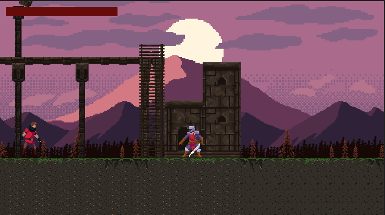

# Desire

Bem-vindo ao Desire, um jogo de plataforma 2D emocionante e desafiador de múltiplas escolhas. Neste jogo, você assumirá o papel de um personagem com um forte desejo de alcançar seu objetivo final.

Você terá a oportunidade de fazer escolhas importantes ao longo do jogo, o que afetará o final. Escolha sabiamente, pois cada escolha pode mudar completamente o resultado do jogo.

Desire é um jogo emocionante que irá testar suas habilidades e decisões. Você está pronto para assumir o desafio e alcançar seu desejo final? Baixe agora e comece a jogar!

### 🏃‍♀️Basic move

- [x] Walk
- [x] Run
- [x] Jump
- [x] Fight

### 💻Learned skills
- [x] Unity
- [x] CSharp
- [x] Movement 2D
- [x] Cinemachine
- [x] Animator
- [x] Animation
